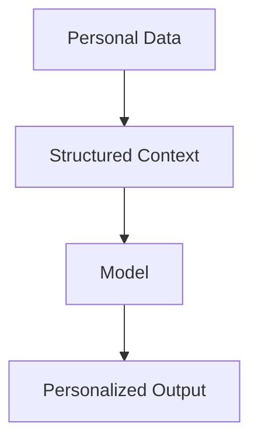

# 🔐 Local AI Systems & Private Model Workflows  

**Date:** April 03, 2026  
**Focus:** Local AI, Privacy, Model Control, and Ownership of Data  

---

## 🧭 Overview  

This documentation explores the concept of running AI systems locally as an alternative to cloud-based AI interactions.

The goal is to understand how **local model execution** changes the dynamics of:

- Data privacy  
- Idea ownership  
- Model control  
- System-level trust  

This marks a shift from being a passive user of AI systems to actively controlling how those systems operate.

---

## 🧠 Core Motivation  

Modern AI usage is largely dependent on cloud-based systems.

While these systems provide high capability, they introduce important concerns:

- Where do user inputs go?  
- How are prompts stored or reused?  
- Can ideas influence future model outputs?  
- What level of control does the user actually have?  

👉 These questions led to exploring **local AI systems**.

---

## ⚙️ System Architecture  

### 🔹 Cloud-Based AI (Traditional Model)  

```

User → Internet → Cloud AI Model → Response

````

### 🔁 Cloud Flow (Mermaid)

```mermaid
graph LR
U[User Input] --> I[Internet]
I --> C[Cloud Model]
C --> R[Response]
````

### 🔍 Key Characteristics

* External processing
* Limited visibility into data handling
* Shared infrastructure
* Potential exposure of prompts and ideas

---

### 🔹 Local AI Model (Ollama-Based)

```
User → Local Machine → Local Model → Response
```

### 🔁 Local Flow (Mermaid)


---

### 🔍 Key Characteristics

* Fully local execution
* No external data transmission
* Increased privacy and control
* Reduced dependency on external systems

---

## 🧪 Current Setup

* **Runtime:** Ollama
* **Models:**

  * Gemma (4B)
  * LLaMA (3B)

👉 These models are lightweight enough to run locally while still enabling meaningful experimentation.

---

## 🧠 Personal Context Injection

A key experiment involved structuring personal data to guide model responses.

### ⚙️ Context Flow

```
Personal Data (Markdown/JSON) → Context Injection → Model → Personalized Output
```

### 🔁 Context System (Mermaid)



---

### 🔍 Explanation

* Personal data is structured into machine-readable formats
* Injected into prompts or system context
* Enables consistency in tone, reasoning, and response patterns

👉 This transforms the model from a general system into a **context-aware assistant**.

---

## 🔍 Key Concepts

### 🔹 Local AI vs Cloud AI

| Aspect       | Cloud AI          | Local AI           |
| ------------ | ----------------- | ------------------ |
| Control      | Limited           | High               |
| Privacy      | External handling | Fully local        |
| Scalability  | High              | Hardware dependent |
| Transparency | Low               | High               |

---

### 🔹 Prompt Privacy

Prompt privacy refers to how user inputs are handled by AI systems.

**Concerns:**

* Data retention
* Model training influence
* Indirect reuse of ideas

👉 Local AI minimizes these risks by keeping interactions isolated.

---

### 🔹 Idea Ownership

When interacting with AI systems, especially cloud-based ones:

* Inputs may contribute to broader system behavior
* Boundaries of ownership can become unclear

👉 Local systems create a **clear boundary between user and model**.

---

## 🔐 Security Perspective

Local AI systems introduce both advantages and trade-offs.

### ✅ Advantages

* Reduced risk of data leakage
* Isolation from external systems
* Controlled experimentation environment

### ⚠️ Considerations

* Local system security becomes critical
* Model limitations (smaller models vs cloud-scale models)
* Resource constraints (CPU, GPU, memory)

---

## 📊 System Comparison

```
Cloud AI:  High Capability → Lower Control  
Local AI:  Moderate Capability → High Control
```

👉 The trade-off is between **power and ownership**.

---

## 📌 Key Takeaways

* Local AI shifts control from provider to user
* Privacy is significantly improved in local environments
* Structured context enables personalized model behavior
* Cloud AI introduces potential risks around data exposure
* AI usage should be evaluated from both capability and control perspectives

---

## ✍🏽 Reflection

Running models locally changes the interaction model entirely.

Instead of simply querying a system, there is now a sense of **ownership and responsibility** over how the system behaves.

This approach also introduces a deeper awareness of how AI systems process, retain, and potentially expose information.

It reinforces the idea that AI is not just about performance, but also about **trust, boundaries, and system design**.

---

## 🚀 Next Focus

* Comparing performance: Local vs Cloud models
* Prompt engineering for local systems
* AI security risks in local environments
* Building a structured personal AI assistant system

