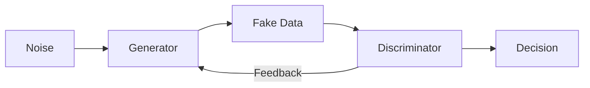
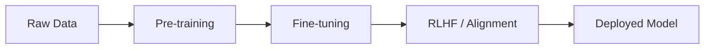
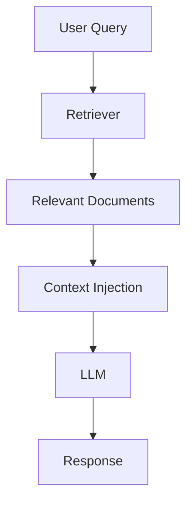

# 📘 Day 02: Generative Models, Training Methods & Learning Paradigms  

**Date:** April 01, 2026  
**Track:** AWS AI Practitioner  
**Focus:** Generative Models, Model Training (Pre-training, RLHF), and Learning Types  

---

## 🧭 Overview  

This session explores how modern AI systems generate content, how they are trained, and the learning paradigms that power them.

The emphasis is on understanding **generative architectures**, **training workflows**, and how models learn from both structured and unstructured data.

---

## 🧠 Key Concepts  

### 🔹 Embeddings & Vectors  

Embeddings are numerical representations of data such as text, images, or tokens.

- Each token is mapped to a vector  
- Captures semantic relationships  
- Enables similarity understanding  

### 📊 Representation Flow  

```

Word → Token → Vector (Embedding) → Model Understanding

```

---

## 🎨 Generative Models  

### 🔹 Diffusion Models  

Diffusion models generate data by learning to reverse noise.

### ⚙️ Diffusion Process  

```

Noise → Noise + Structure → Refined Signal → Final Output (Image/Text)

````

### 🔁 Conceptual Flow (Mermaid)

```mermaid
graph LR
A[Random Noise] --> B[Add Structure]
B --> C[Refinement Process]
C --> D[Generated Output]
````

---

### 🔹 Generative Adversarial Networks (GANs)

GANs consist of two competing neural networks:

* **Generator:** Creates synthetic data
* **Discriminator:** Distinguishes real vs fake

### ⚙️ GAN Architecture

```
Noise → Generator → Fake Data → Discriminator → Real / Fake
                    ↑______________________________|
                          Feedback Loop
```

### 🔁 GAN Flow (Mermaid)



---

### 🔹 Variational Autoencoders (VAEs)

VAEs encode and reconstruct data through a latent space.

* **Encoder:** Compresses input
* **Decoder:** Reconstructs output

### ⚙️ VAE Flow

```
Input Data → Encoder → Latent Space → Decoder → Reconstructed Output
```

---

## ⚙️ Model Training Processes

### 🔹 Training Pipeline

```
Raw Data → Pre-training → Fine-tuning → Alignment → Deployment
```

### 🔁 Training Lifecycle (Mermaid)



---

### 🔹 Pre-training

Models are trained on large datasets to learn general patterns and representations.

---

### 🔹 Instruction Fine-Tuning

* Uses structured examples
* Aligns model behavior with tasks
* Improves usability

---

### 🔹 Reinforcement Learning from Human Feedback (RLHF)

Uses human evaluation to refine model outputs.

### ⚙️ RLHF Flow

```
Model Output → Human Feedback → Reward Signal → Model Adjustment
```

---

## 🔍 Retrieval-Augmented Generation (RAG)

RAG improves responses by integrating external knowledge.

### ⚙️ RAG Pipeline

```
Query → Retriever → Documents → Context → Model → Response
```

### 🔁 RAG Flow (Mermaid)



---

## 📊 Learning Paradigms

### 🔹 Supervised Learning

Uses labeled data to learn input-output mappings.

#### Types:

* Classification
* Regression

---

### 🔹 Unsupervised Learning

Learns patterns from unlabeled data.

#### Techniques:

* **Clustering:** Groups similar data
* **Dimensionality Reduction:** Reduces feature space

### ⚙️ Learning Comparison

```
Supervised:   Input + Label → Model → Prediction  
Unsupervised: Input Only → Model → Patterns
```

---

## 🌍 Real-World Applications

* Image and media generation
* Synthetic datasets
* Recommendation systems
* Fraud detection
* Conversational AI systems

---

## 🔐 Security Perspective

Generative systems introduce new risks:

* Deepfakes and synthetic manipulation
* Prompt injection attacks
* Data poisoning
* Model hallucination and reliability issues

AI systems must be treated as **both tools and attack surfaces**.

---

## 📌 Key Takeaways

* Generative models create new data, not just analyze
* GANs, VAEs, and Diffusion models differ in approach
* Training involves multiple stages (pre-training → alignment)
* RAG improves reliability using external knowledge
* Learning paradigms define how models interpret data

---

## ✍🏽 Reflection

This session clarified how generative systems are structured and trained.

Understanding the differences between architectures and training methods provided a clearer picture of how modern AI systems—especially LLMs—are built and refined.

The introduction of RAG highlighted the importance of grounding models in external knowledge for reliability.

---

## 🚀 Next Focus

* Transformer architecture (attention mechanisms)
* Tokenization in LLMs
* AWS AI services (Bedrock, SageMaker)
